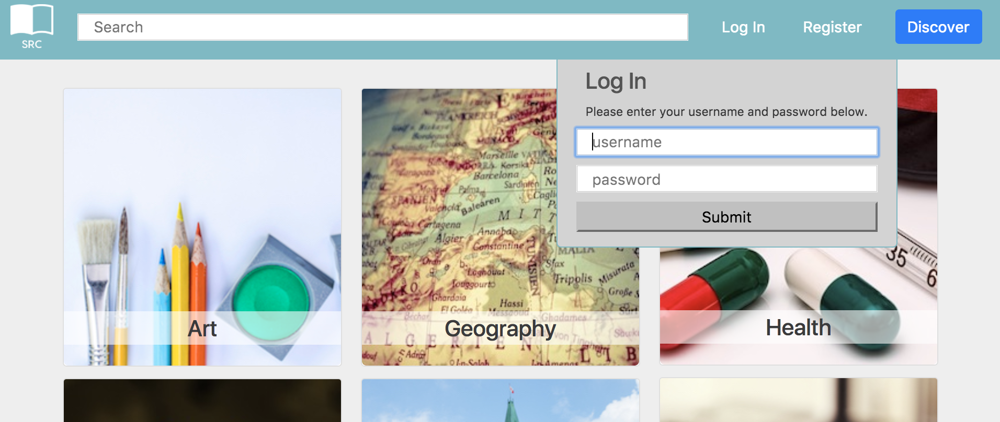
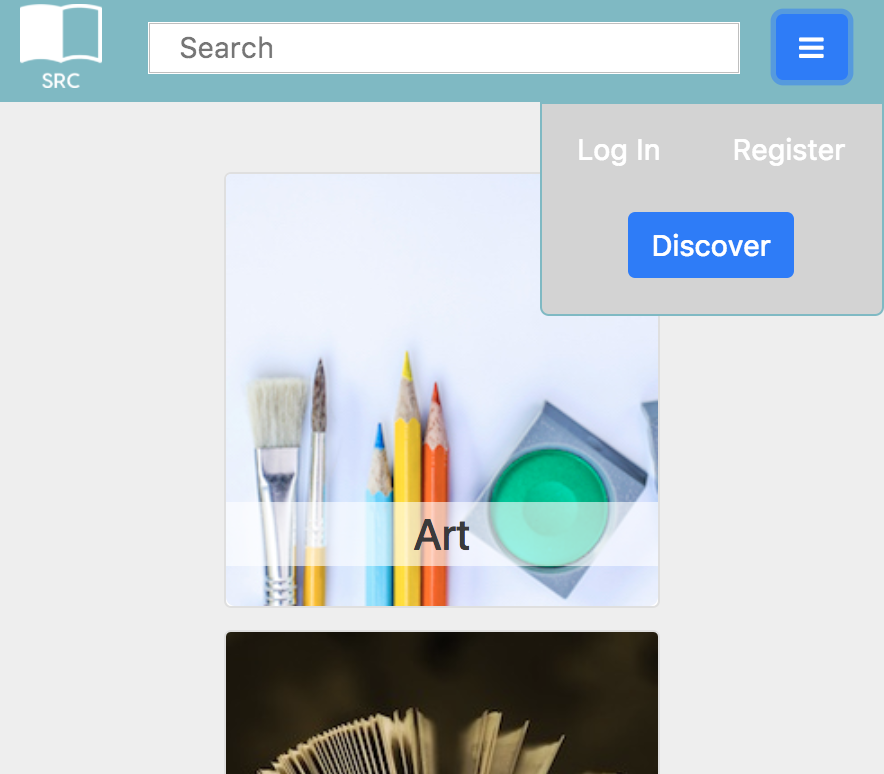
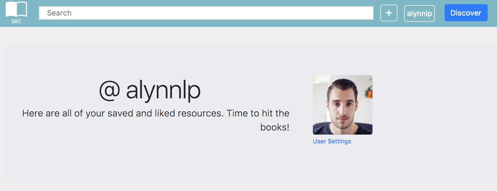
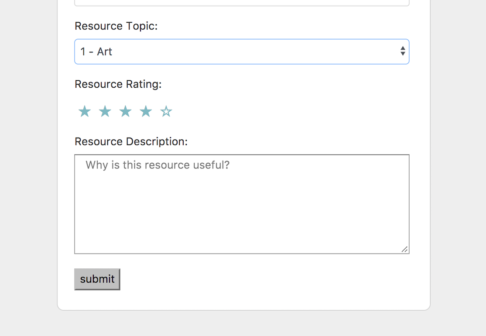

# SRC Web Applicaiton

## Getting Started

1. Create the `.env` by using `.env.example` as a reference: `cp .env.example .env`
2. Update the .env file with your correct local information
3. Install dependencies: `npm i`
4. Fix to binaries for sass: `npm rebuild node-sass`
5. Run migrations: `npm run knex migrate:latest`
  - Check the migrations folder to see what gets created in the DB
6. Run the seed: `npm run knex seed:run`
  - Check the seeds file to see what gets seeded in the DB
7. Run the server: `npm run local`
8. Visit `http://localhost:8080/`

## Dependencies

- "Node": 5.10.x or above
- "NPM": 3.8.x or above
- "bcrypt": "^1.0.3",
- "body-parser": "^1.15.2",
- "cookie-session": "^1.3.2",
- "dotenv": "^2.0.0",
- "ejs": "^2.4.1",
- "express": "^4.13.4",
- "faker": "^4.1.0",
- "knex": "^0.11.7",
- "knex-logger": "^0.1.0",
- "morgan": "^1.7.0",
- "node-sass-middleware": "^0.9.8",
- "pg": "^6.0.2"

# Behaviour

1.  Register and Login Design ["Dropdown Menu for user"](https://github.com/alynnlp/BAB/blob/master/docs/dropdown.png?raw=true)

    

    - Usage of jQuery trigger a function to an event handler, the click button for the selected elements, to pop up a form to submit user's information

2. Implementing Bootstrap framework ["Responsive Design"](https://github.com/alynnlp/BAB/blob/master/docs/responsive.png?raw=true)

    

    - Leverage a popular HTML,CSS and Javascript framework for developing responsive design for different devices

3. Routing between client and database ["Communication between server and browser"](https://github.com/alynnlp/BAB/blob/master/docs/servertobrowser.png?raw=true)

    

    - Using user information stored in cookie-session to dynamically change browser's display

4. Styling ["Star lights up when rating"](https://github.com/alynnlp/BAB/blob/master/docs/star.png?raw=true)

    

    -  CSS3 styling can create animation on selected element and post user's data to the server using jQuery
